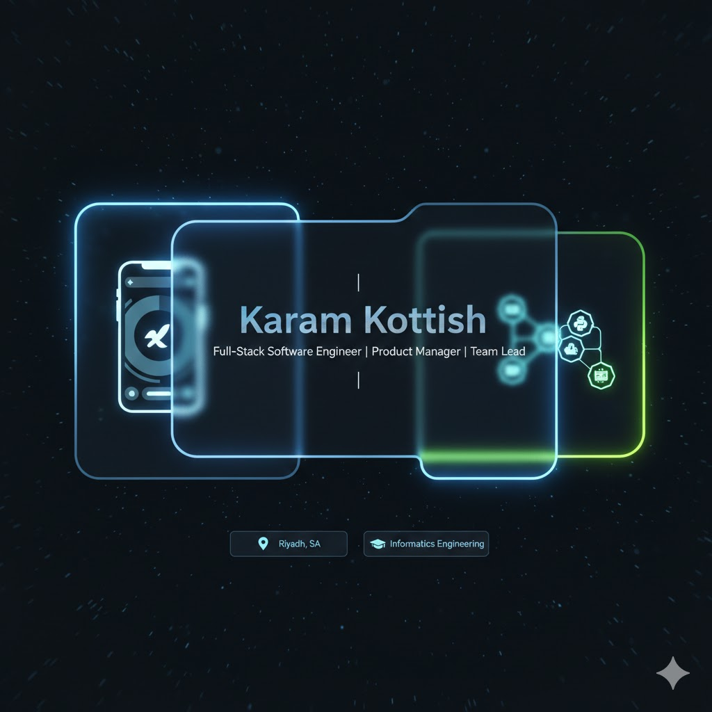

  

  

  
  

---

### 🚀 Professional Manifesto
I am a product-driven Full-Stack Software Engineer and Team Lead with over 3 years of experience building scalable mobile and web ecosystems. I specialize in translating complex business requirements into high-performance digital products using 2026-standard Agile delivery. I bridge the gap between technical execution and product strategy to ensure every line of code adds business value.

---

### 🛠️ Technical Ecosystem
| Category | Technologies |
| :--- | :--- |
| **Mobile Core** | Flutter, Dart, React Native, Expo Go, Material 3 UI |
| **Web Strategy** | React.js, Next.js, TypeScript, Tailwind CSS, GraphQL |
| **Backend/Cloud** | Python (FastAPI), PHP, SQL, Firebase, AWS |
| **Execution** | Agile, CI/CD, Product Roadmaps, Jira, Git |

---

### 📂 Featured Ecosystems
| Project | Role | Tech Stack |
| :--- | :--- | :--- |
| **🐾 Paws Pal Connect** | Full-Stack Developer | Flutter, FastAPI, React |
| **🎓 My University App** | Product Owner/Dev | React Native, Expo, Material 3 |
| **🛡️ Chatly** | Security Lead | PHP & Next.js |
| **🎨 Revonix** | Graduation Lead | Flutter (Artisan Marketplace) |

---

### 🔄 Recent Activity & Contributions

  

---

### 📊 Strategic Insights

  
  

---

### 🏆 Credentials & Growth
* 🎓 **Informatics Engineering** (5th Year) – Al Sham Private University
* ☁️ **Google Cloud AI Innovation** – Simplilearn powered by Google Cloud
* 📊 **Product Management Core Skills** – Udemy
* 🏫 **Certified Trainer (TOT)** – Leadership Specialist (60 hrs)

---

### 📫 Connect with the Lead

  

