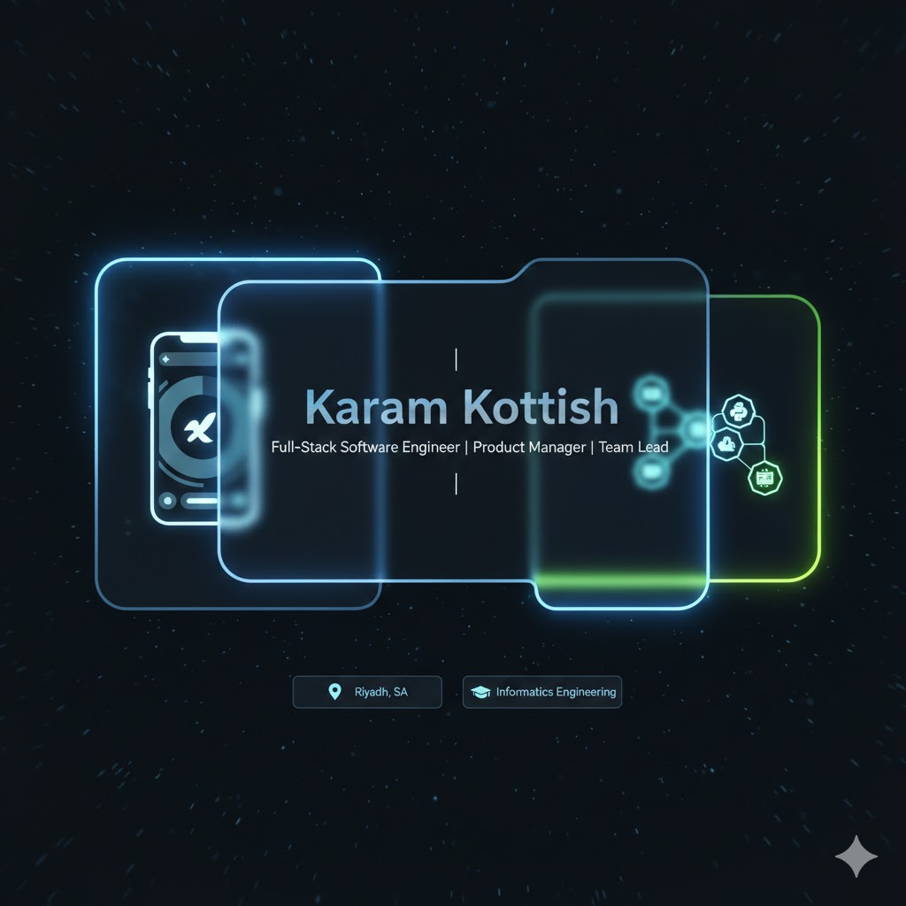
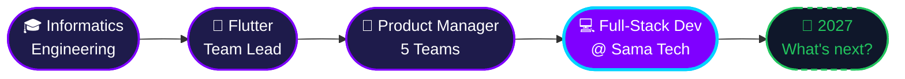
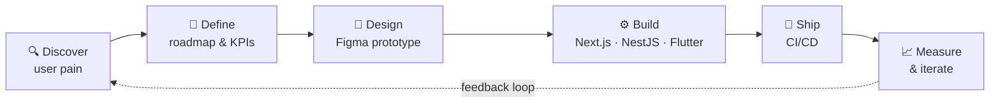
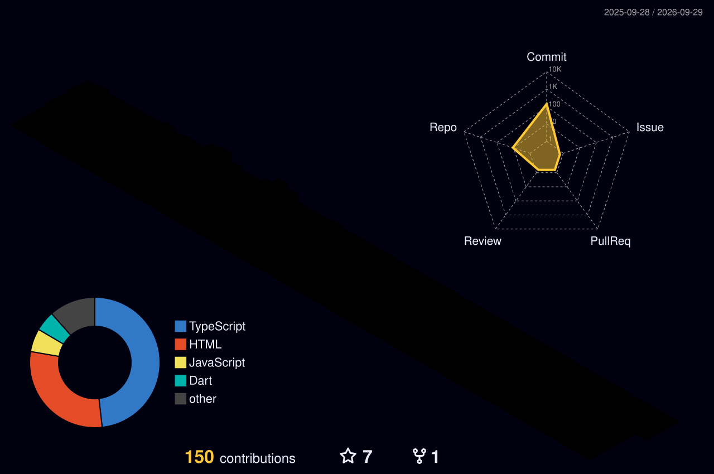

<!-- ✦ Animated aurora header ✦ -->
<p align="center">
  
</p>

<!-- ✦ Terminal-style typing animation ✦ -->
<p align="center">
  <a href="https://github.com/Karamkottish"></a>
</p>

<p align="center">
  
</p>

<p align="center">
  
  
  
</p>

<h3 align="center">مرحباً 👋 &nbsp;·&nbsp; Hello, World &nbsp;·&nbsp; Welcome to my corner of the internet</h3>

---

## ⚡ Right Now

> [!NOTE]
> **`status: building`** — Last updated **October 2026**
> - 🏢 Shipping production features at **Sama Tech** with Next.js, NestJS & Prisma
> - 🎓 Wrapping up my final year of Informatics Engineering — graduating **early 2027**
> - 🤝 Leading projects as **Project Manager** at the Student Union
> - 🔍 Looking for my next role as a **Full-Stack Engineer** or **Product Manager** — remote or in the Gulf

> [!TIP]
> Hiring? Jump straight to **[🤝 Let's Connect](#-lets-connect)** — I can start immediately.

---

## 👨‍💻 About Me

I'm a **product-driven Full-Stack Engineer and Team Lead** who turns complex business requirements into fast, scalable web and mobile products. I sit where engineering meets product strategy — I write the code *and* make sure every feature ships real business value.

```ts
const karam = {
  role:        "Full-Stack Developer @ Sama Tech",
  stack:       ["Next.js", "React", "Node.js", "NestJS", "Prisma", "MySQL"],
  mobile:      ["Flutter", "React Native", "Expo"],
  leadership:  ["Team Lead", "Product Manager", "Student Union Project Manager"],
  education:   "B.Sc. Informatics Engineering — Al Sham Private University (Class of 2027)",
  openTo:      ["Full-Stack Engineer", "Product Manager", "Remote", "Gulf Relocation"],
  funFact:     "I build 3D solar systems in the browser for fun 🪐",
};
```

- 🔭 Currently shipping production apps with **Next.js, NestJS & Prisma** at **Sama Tech**
- 🌱 Exploring **WebGL / Three.js**, AI-powered product features and modern DX tooling
- 🧭 Led **5 cross-functional teams** (AI, Backend, Frontend, Flutter, Marketing) as Product Manager at **Paws Pal Connect**
- 🎓 Final-year Informatics Engineering student — graduating **early 2027**
- 💬 Ask me about **Next.js architecture, Flutter, Agile delivery, or product roadmaps**

---

## 🛠️ Tech Stack

<p align="center"><b>Frontend</b></p>
<p align="center">
  
</p>

<p align="center"><b>Backend & Data</b></p>
<p align="center">
  
</p>

<p align="center"><b>Mobile</b></p>
<p align="center">
  
</p>

<p align="center"><b>Cloud & Tooling</b></p>
<p align="center">
  
</p>

<p align="center">
  
  
  
  
  
</p>

---

## 💼 Experience

| Role | Company | Highlights |
| :--- | :--- | :--- |
| **Full-Stack Developer** | Sama Tech · *Current* | Building production web apps with Next.js, React, Node.js, NestJS, Prisma & MySQL |
| **Product Manager** | Paws Pal Connect | Led 5 teams — AI, Backend, Frontend, Flutter & Marketing — from roadmap to release |
| **Flutter Team Lead** | Paws Pal Connect | Mentored & led 4 interns delivering the cross-platform mobile app |
| **Project Manager** | Student Union | Planning and delivering student-council initiatives end to end |

### 🗺️ My Journey


```mermaid
flowchart LR
    A(["🎓 Informatics<br/>Engineering"]) --> B(["📱 Flutter<br/>Team Lead"])
    B --> C(["🧭 Product Manager<br/>5 Teams"])
    C --> D(["💻 Full-Stack Dev<br/>@ Sama Tech"])
    D --> E(["🚀 2027<br/>What's next?"])

    classDef past fill:#1e1b4b,stroke:#7F00FF,color:#fff,stroke-width:2px
    classDef now fill:#7F00FF,stroke:#00D4FF,color:#fff,stroke-width:3px
    classDef next fill:#0f172a,stroke:#22C55E,color:#22C55E,stroke-width:2px,stroke-dasharray:5 5
    class A,B,C past
    class D now
    class E next
```

<details>
<summary><b>🧠 How I ship products — my playbook (click to expand)</b></summary>
<br/>


```mermaid
flowchart LR
    D["🔍 Discover<br/>user pain"] --> R["🎯 Define<br/>roadmap & KPIs"]
    R --> U["🎨 Design<br/>Figma prototype"]
    U --> B["⚙️ Build<br/>Next.js · NestJS · Flutter"]
    B --> S["🚢 Ship<br/>CI/CD"]
    S --> M["📈 Measure<br/>& iterate"]
    M -.feedback loop.-> D
```

1. **Start with the problem, not the tech.** Every sprint maps to a measurable business outcome.
2. **Small, frequent releases.** CI/CD and feature flags over big-bang launches.
3. **Teams own outcomes.** As a PM I gave each team (AI, Backend, Frontend, Flutter, Marketing) clear goals and room to decide how.
4. **Performance is a feature.** 60fps animations and fast load times are part of the spec, not a nice-to-have.

</details>

---

## 🚀 Featured Projects

| Project | What it is | Stack |
| :--- | :--- | :--- |
| 🪐 [**Cosmic Journey**](https://github.com/Karamkottish/Solarsystem3D) | Scroll-driven 3D solar system with Keplerian orbits, custom shaders & NASA APOD live data | Three.js · WebGL2 · Vite |
| 🎮 [**NexusPlay**](https://github.com/Karamkottish/GamingFullstack) | White-label gaming platform UI — 3D flip auth, glassmorphism, 60fps animations | Next.js 16 · Tailwind · Framer Motion · Zustand |
| 🍰 [**RK Sweet House**](https://github.com/Karamkottish/RK-SWEETHOUSE) | Modern storefront with interactive 3D elements | Next.js · Tailwind · React Three Fiber |
| 🌿 [**BustaniPlus**](https://github.com/Karamkottish/BustaniPlus) | Cross-platform mobile app | React Native · Expo · TypeScript |
| 🎓 [**My University App**](https://github.com/Karamkottish/MyUniversity) | University companion app — Product Owner & Developer | React Native · Expo · Material 3 |
| 🐾 **Paws Pal Connect** | Pet-care ecosystem across mobile & web | Flutter · FastAPI · React |
| 🎨 **Revonix** | Graduation project — artisan marketplace | Flutter |
| 🛡️ **Chatly** | Secure chat platform — Security Lead | PHP · Next.js |
| 🌐 [**Portfolio**](https://karamkottish.github.io/Karam_Portiofolio/) | My personal portfolio site | TypeScript · React |

---

## 📊 GitHub Analytics

<p align="center">
  
  
</p>

<p align="center">
  
</p>

### 🧊 3D Contribution Graph

<p align="center">
  
</p>

### 🐍 Watch the Snake Eat My Contributions

<p align="center">
  <picture>
    <source media="(prefers-color-scheme: dark)" srcset="https://raw.githubusercontent.com/Karamkottish/Karamkottish/output/github-snake-dark.svg" />
    <source media="(prefers-color-scheme: light)" srcset="https://raw.githubusercontent.com/Karamkottish/Karamkottish/output/github-snake.svg" />
    
  </picture>
</p>

---

## 🎯 2027 Quest Log

- [x] Lead a 5-team product as Product Manager
- [x] Ship production apps with Next.js, NestJS & Prisma
- [x] Build a real-time 3D solar system in WebGL
- [ ] 🎓 Graduate in Informatics Engineering — *early 2027*
- [ ] 🚀 Land my next Full-Stack / Product role
- [ ] 🤖 Ship an AI-powered product to real users
- [ ] 🌍 Contribute to a major open-source project

---

## 🏆 Credentials & Growth

- 🎓 **B.Sc. Informatics Engineering** (Final Year, graduating 2027) — Al Sham Private University
- ☁️ **Google Cloud AI Innovation** — Simplilearn, powered by Google Cloud
- 📊 **Product Management Core Skills** — Udemy
- 🏫 **Certified Trainer (TOT)** — Leadership Specialist (60 hrs)

---

## 🤝 Let's Connect

<p align="center">
  <a href="https://www.linkedin.com/in/karam-kottish/"></a>
  <a href="mailto:Karamkottish@gmail.com"></a>
  <a href="https://karamkottish.github.io/Karam_Portiofolio/"></a>
</p>

<p align="center">
  
</p>

<p align="center">
  <sub>Designed & engineered by <b>Karam Kottish</b> · Full-Stack Engineer & Product Strategist · Last updated October 2026</sub>
</p>

<!-- ✦ Animated aurora footer ✦ -->
<p align="center">
  
</p>
